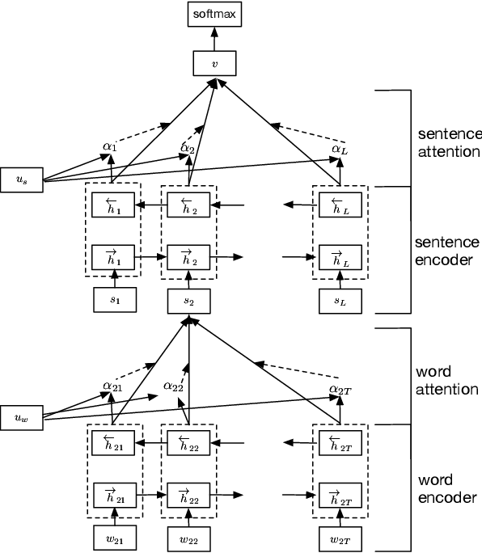
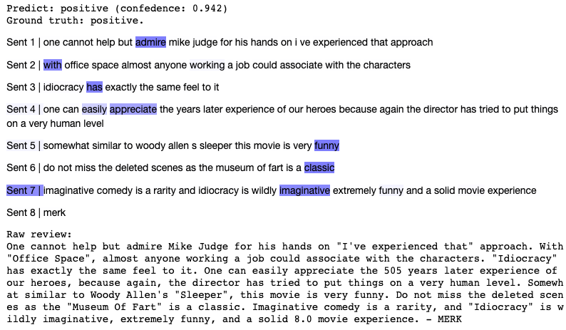

# Hierarchical attention for sentiment classification.

Our recipe based on highly cited paper
[Hierarchical Attention Networks for Document Classification](https://arxiv.org/abs/1608.07775),
(Z. Yang et al.) published in 2017. We will classify the IMDB's reviews as positive and negative
(25k reviews for train and the same number for test). The proposed neural network architecture takes two steps:
1. It encodes sentences. The attention mechanism predicts the importance for each **word** in the final embedding of a **sentence**.
2. It encodes texts. This time, the attention mechanism predicts the importance for each **sentence** in the final embedding of a **text**.

This architecture is interesting because we can make an illustration to understand what words and sentences were
important for prediction. More information can be found in the original article.

The architecture of Hierarchical Attention Network (HAN):

The recipe includes two scenarios. You can **train the model** yourself from scratch with
ability to make changes in data processing or architecture, it isn't tricky.
Or/and you can **play with a trained model** in jupyter notebook: write your own review or pick the random one from 
the test set, then visualize the model’s predictions.

## Technologies
* `Catalyst` as pipeline runner for deep learning tasks. This new and rapidly developing [library](https://github.com/catalyst-team/catalyst) can significantly reduce the amount of boilerplate code. If you are familiar with the TensorFlow ecosystem,
 you can think of Catalyst as Keras for PyTorch. This framework
integrated with logging systems as well known [Tensorboard](https://www.tensorflow.org/tensorboard)
 and new [Weights & biases](https://www.wandb.com/).
* `Pytorch` and `Torchtext` as main frameworks for deeplearning stuff. `NLTK` for data preprocessing.

## Running commands

### 0. Setup.

* `make setup` - before we start doing something, we have to run command, which prepare a docker container with all the necessary dependencies.

* `make download-data-to-storage` - download dataset to storage.

### 1. Training from stratch.

* `make training` - runs the job on Neuro platform with training pipeline which includes logging via **Tensorboard** and **W&B**.
    * If you want to use W&B for logging, please, setup enironment variable before running training command:
     `export WANDB_API_KEY=YOUR_TOKEN`. Then a new project with name `neuro_imdb` will appear in the list of your projects in W&B's Web UI.
    * Note. First run requires more time than next one, since it is necessary to download pretrained word embeddings for Glove and warm up the computing resources.

* `make tensorboard` -  runs the job with tensorboard for monitoring training progress (losses, metrics, computational time and so on).

* `make filebrowser` - runs the job that allows you to conveniently view your files on the storage in yoyr browser.

### 2. Running the notebook.

* `make jupyter` - run job with jupyter. If you skipped training step, you can download our pretrained model from notebook.

  
  
  

# Autogenrated description:

This project is created from 
[Neuro Platform Project Template](https://github.com/neuromation/cookiecutter-neuro-project).

# Development Environment

This project is designed to run on [Neuro Platform](https://neu.ro), so you can jump into problem-solving right away.

## Directory structure

| Local directory                      | Description       | Storage URI                                                                  | Environment mounting point |
|:------------------------------------ |:----------------- |:---------------------------------------------------------------------------- |:-------------------------- | 
| `data/`                              | Data              | `storage:ml-recipe-hier-attention/data/`                              | `/ml-recipe-hier-attention/data/` | 
| `src/` | Python modules    | `storage:ml-recipe-hier-attention/src/` | `/ml-recipe-hier-attention/src/` |
| `notebooks/`                         | Jupyter notebooks | `storage:ml-recipe-hier-attention/notebooks/`                         | `/ml-recipe-hier-attention/notebooks/` |
| No directory                         | Logs and results  | `storage:ml-recipe-hier-attention/results/`                           | `/ml-recipe-hier-attention/results/` |

## Development

Follow the instructions below to set up the environment and start Jupyter development session.

### Setup development environment 

`make setup`

* Several files from the local project are uploaded to the platform storage (namely, `requirements.txt`, 
  `apt.txt`, `setup.cfg`).
* A new job is started in our [base environment](https://hub.docker.com/r/neuromation/base). 
* Pip requirements from `requirements.txt` and apt applications from `apt.txt` are installed in this environment.
* The updated environment is saved under a new project-dependent name and is used further on.

### Run Jupyter with GPU 

`make jupyter`

* The content of `src` and `notebooks` directories is uploaded to the platform storage.
* A job with Jupyter is started, and its web interface is opened in the local web browser window.

### Kill Jupyter

`make kill-jupyter`

* The job with Jupyter Notebooks is terminated. The notebooks are saved on the platform storage. You may run 
  `make download-notebooks` to download them to the local `notebooks/` directory.

### Help

`make help`

## Data

### Uploading via Web UI

On local machine run `make filebrowser` and open job's URL on your mobile device or desktop.
Through a simple file explorer interface, you can upload test images and perform file operations.

### Uploading via CLI

On local machine run `make upload-data`. This command pushes local files stored in `./data`
into `storage:ml-recipe-hier-attention/data` mounted to your development environment's `/project/data`.

## Customization

Several variables in `Makefile` are intended to be modified according to the project specifics. 
To change them, find the corresponding line in `Makefile` and update.

### Data location

`DATA_DIR_STORAGE?=$(PROJECT_PATH_STORAGE)/$(DATA_DIR)`

This project template implies that your data is stored alongside the project. If this is the case, you don't 
have to change this variable. However, if your data is shared between several projects on the platform, 
you need to change the following line to point to its location. For example:

`DATA_DIR_STORAGE?=storage:datasets/cifar10`

### Training machine type

`TRAINING_MACHINE_TYPE?=gpu-small`

There are several machine types supported on the platform. Run `neuro config show` to see the list.

### HTTP authentication

`HTTP_AUTH?=--http-auth`

When jobs with HTTP interface are executed (for example, with Jupyter Notebooks or TensorBoard), this interface requires
a user to be authenticated on the platform. However, if you want to share the link with someone who is not registered on
the platform, you may disable the authentication updating this line to `HTTP_AUTH?=--no-http-auth`.

### Training command

`TRAINING_COMMAND?='echo "Replace this placeholder with a training script execution"'`

If you want to train some models from code instead of Jupyter Notebooks, you need to update this line. For example:

`TRAINING_COMMAND="bash -c 'cd $(PROJECT_PATH_ENV) && python -u $(CODE_DIR)/train.py --data $(DATA_DIR)'"`

